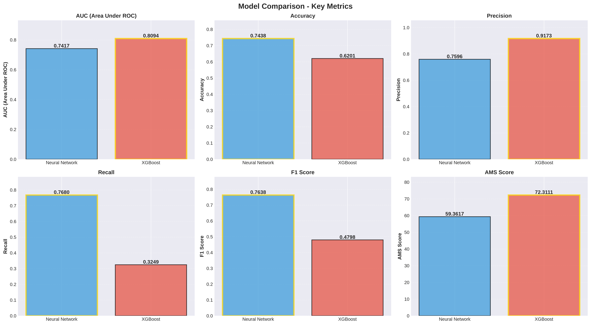
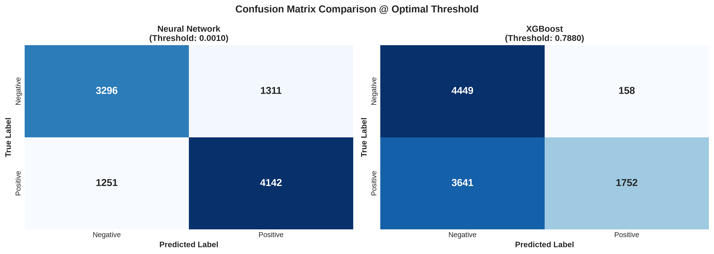
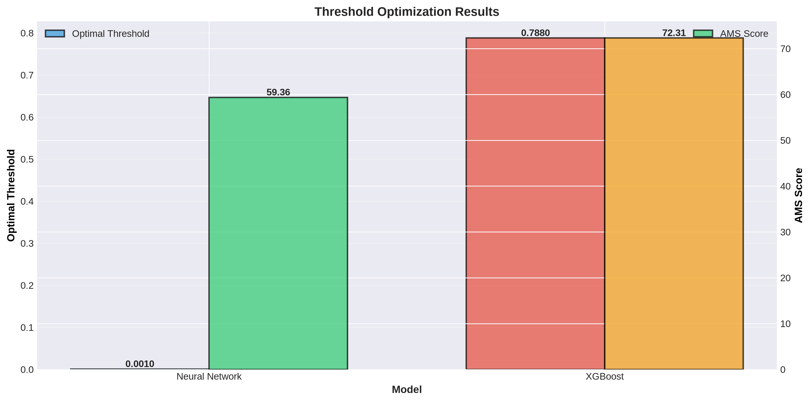
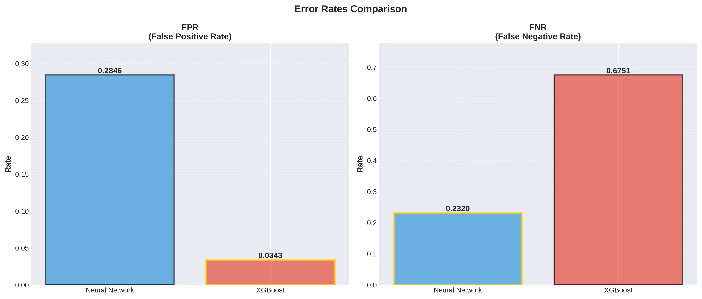

# Higgs Boson Detection with Deep Neural Networks

Classifying simulated particle collision events as Higgs boson signal or background noise using deep feedforward neural networks and XGBoost, based on the [HIGGS dataset](https://archive.ics.uci.edu/dataset/280/higgs) from the UCI ML Repository.

Inspired by [Baldi, Sadowski & Whiteson (2014)](https://www.nature.com/articles/ncomms5308) — *Searching for Exotic Particles in High-Energy Physics with Deep Learning*, Nature Communications.

---

## Background

In 2012, CERN's ATLAS and CMS experiments confirmed the existence of the Higgs boson. Detecting these events is a challenging classification problem: the Higgs signal is rare and closely resembles background processes from other particle interactions.

Baldi et al. (2014) demonstrated that deep neural networks can outperform traditional boosted decision trees for this task, particularly when using raw low-level kinematic features rather than hand-engineered physics features. This project reproduces that comparison.

---

## Results

Trained on 88,000 samples, validated on 10,000, tested on 10,000 (subsampled from the full 11M dataset).

### Key Metrics

| Metric | Neural Network | XGBoost |
|--------|---------------|---------|
| **ROC AUC** | 0.7417 | **0.8094** |
| **AMS** | 59.36 | **72.31** |
| **Accuracy** | **0.7438** | 0.6201 |
| **Precision** | 0.7596 | **0.9173** |
| **Recall** | **0.7680** | 0.3249 |
| **F1 Score** | **0.7638** | 0.4798 |
| **Brier Score** | 0.2562 | **0.1781** |
| **Log Loss** | 9.2344 | **0.5301** |

### Confusion Matrix Breakdown

| | Neural Network | XGBoost |
|--|---------------|---------|
| True Positives | 4,142 | 1,752 |
| False Positives | 1,311 | 158 |
| True Negatives | 3,296 | 4,449 |
| False Negatives | 1,251 | 3,641 |
| Sensitivity | 0.7680 | 0.3249 |
| Specificity | 0.7154 | 0.9657 |
| FPR | 0.2846 | 0.0343 |
| FNR | 0.2320 | 0.6751 |

### Analysis

- **XGBoost wins on discrimination** (AUC 0.81 vs 0.74) and probability calibration (Brier 0.18 vs 0.26)
- **Neural Network wins on recall** (0.77 vs 0.32) — it catches more actual signal events
- **XGBoost is highly precise** (0.92) but conservative — it misses 67.5% of real signals (high FNR)
- The NN provides a more balanced precision/recall trade-off (F1 0.76 vs 0.48)

> **Note:** The neural network was trained on a small subsample (88K). Performance improves significantly with more data — the original paper used the full 11M events, where deep NNs surpass gradient boosting on low-level features.

### Plots

<p align="center">
  
</p>
<p align="center"><em>Side-by-side metric comparison between Neural Network and XGBoost</em></p>

<p align="center">
  
</p>
<p align="center"><em>Confusion matrices showing classification behavior differences</em></p>

<p align="center">
  
</p>
<p align="center"><em>AMS score vs decision threshold — optimal operating points</em></p>

<p align="center">
  
</p>
<p align="center"><em>Error rate comparison: FPR vs FNR trade-offs</em></p>

### Metric Definitions

- **ROC AUC** — Area under the receiver operating characteristic curve
- **AMS** — Approximate Median Significance, the physics-standard metric: `sqrt(2 * [s * ln(1 + s/b) - s])`
- **Brier Score** — Mean squared error of predicted probabilities (lower is better)
- **Log Loss** — Cross-entropy loss on predicted probabilities (lower is better)

---

## Dataset

**Source:** [HIGGS — UCI Machine Learning Repository](https://archive.ics.uci.edu/dataset/280/higgs)

| Property | Value |
|----------|-------|
| Total events | 11,000,000 |
| Features | 28 (21 low-level kinematic + 7 high-level physics-derived) |
| Labels | Binary — signal (1) vs background (0) |
| Class balance | 53% signal / 47% background |
| Missing values | None |
| Size on disk | ~7 GB |

**Feature types:**
- **Low-level (1-21):** Raw kinematic measurements from the detector (momenta, angles, energies)
- **High-level (22-28):** Physics-derived quantities computed from low-level features (invariant masses, angular separations)

---

## Model Architecture

### Deep Neural Network

A 5-layer feedforward network with batch normalization and dropout:

```
Input (28 features)
    |
Linear(28, 500)
    |
[Linear -> BatchNorm -> ReLU -> Dropout(0.5)] x 4
    |    (300, 200, 100, 50 units)
    |
Linear(50, 2) -> Softmax
    |
Output (signal probability)
```

**Training configuration:**
- Optimizer: Adam (lr=1e-3, weight_decay=1e-6)
- Loss: CrossEntropyLoss
- Batch size: 1,024
- Epochs: 100 (best checkpoint at epoch 77)

### XGBoost Baseline

- 100 estimators, max depth 5
- Learning rate: 0.1
- Subsampling: 80% rows, 80% columns per tree

---

## Project Structure

```
.
├── main.py                          # End-to-end pipeline
├── src/
│   ├── config.py                    # Hyperparameters and paths
│   ├── data.py                      # PyTorch Dataset class
│   ├── models.py                    # NN and XGBoost model definitions
│   ├── train.py                     # Training loop with checkpointing
│   ├── evaluate.py                  # AUC, AMS metrics, threshold optimization
│   ├── plotting.py                  # EDA and evaluation visualizations
│   └── utils.py                     # Seeding, checkpointing, EDA summary
├── scripts/
│   ├── download_data.py             # Download dataset from Kaggle
│   └── prepare_data.py              # Split, normalize, save to CSV
├── notebooks/
│   ├── 01_data_exploration.ipynb    # EDA: distributions, correlations, PCA
│   ├── 02_training.ipynb            # Model training and evaluation
│   └── 03_results_analysis.ipynb    # Results comparison
├── pyproject.toml
└── requirements.txt
```

---

## Getting Started

### Prerequisites

- Python 3.13+
- CUDA-capable GPU (optional, falls back to CPU)
- [Kaggle API credentials](https://www.kaggle.com/docs/api) for dataset download

### Installation

```bash
git clone https://github.com/YOUR_USERNAME/higgs-boson-detection.git
cd higgs-boson-detection
pip install -r requirements.txt
```

### Download and Prepare Data

```bash
python scripts/download_data.py
python scripts/prepare_data.py
```

This downloads the HIGGS dataset from Kaggle, splits it into train/val/test sets (80/10/10), applies StandardScaler normalization, and saves the processed CSVs.

### Train and Evaluate

```bash
python main.py
```

Or use the notebooks for an interactive workflow:

1. `notebooks/01_data_exploration.ipynb` — Explore the dataset
2. `notebooks/02_training.ipynb` — Train models and compare results
3. `notebooks/03_results_analysis.ipynb` — Analyze results

---

## Key EDA Findings

From the exploratory data analysis on the full 11M events:

- **Balanced classes:** 53% signal, 47% background (imbalance ratio 1.13:1) — no class weighting needed
- **No missing values** across all 28 features
- **All features have good variance** after standardization — no low-variance features to remove
- **Weak class separation** (mean separation = 0.0317) — the problem is inherently difficult, consistent with the subtle nature of Higgs signal
- **Extreme outliers present** in 13 features (|z-score| > 10) — gradient clipping recommended during training

---

## Dependencies

- PyTorch
- XGBoost
- scikit-learn
- pandas
- matplotlib / seaborn
- kagglehub

See [requirements.txt](requirements.txt) for pinned versions.

---

## References

1. Baldi, P., Sadowski, P., & Whiteson, D. (2014). [Searching for exotic particles in high-energy physics with deep learning](https://www.nature.com/articles/ncomms5308). *Nature Communications*, 5, 4308.
2. [HIGGS Dataset — UCI ML Repository](https://archive.ics.uci.edu/dataset/280/higgs)
3. [Higgs Boson Machine Learning Challenge — Kaggle](https://www.kaggle.com/c/higgs-boson)

---

## License

MIT
